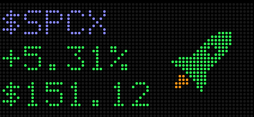

# SPCXTicker

A floating, always-on-top macOS widget that shows stock prices on an LED dot-matrix panel.



- Symbol, percent change, and price rendered in a 5×7 pixel font
- A rocket on the right: green at 45° when the stock is up, red and pointing down when it's down
- Any tickers you like — right-click the panel and choose **Edit Tickers…**
- With two or more tickers, panels dwell for 15 seconds and then scroll right-to-left into the next one
- Polls Yahoo Finance every 15 seconds; a small arrow in the bottom-right corner shows whether the price ticked up (green) or down (red) since the previous poll

## Run

```sh
swift build
./.build/debug/SPCXTicker
```

Drag the black panel to move it. Right-click for **Edit Tickers…**, **Refresh Now**, and **Quit**. Requires macOS 14 or later.
